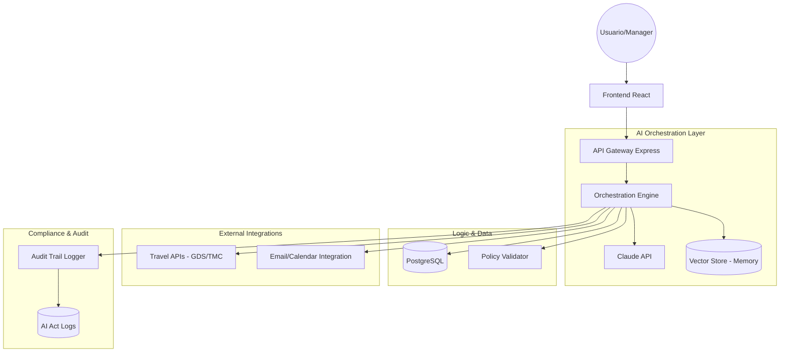

# 🏗️ Technical Architecture — TravelEase

## 1. 🔍 Resumen del Sistema

TravelEase es una aplicación de orquestación de IA diseñada para ser escalable, segura y compatible con la normativa europea (EU AI Act). Utiliza una arquitectura orientada a servicios para separar la lógica de negocio de la lógica de IA y las integraciones con proveedores.

---

## 2. 🛠️ Stack Tecnológico

| Capa | Tecnología | Razón |
|------|------------|-------|
| **Frontend** | React + Tailwind | Velocidad de desarrollo y UI moderna |
| **Backend** | Node.js + Express | Ecosistema rico y manejo eficiente de I/O |
| **AI Orchestration** | LangChain / LangGraph | Gestión de workflows de agentes AI |
| **LLM** | Anthropic Claude API | Alta precisión en razonamiento y contexto largo |
| **Base de Datos** | PostgreSQL | Robustez relacional para transacciones |
| **Caching** | Redis | Optimización de tokens y latencia |
| **Compliance** | OpenTelemetry | Trazabilidad para cumplimiento legal |

---

## 3. 🗺️ Arquitectura de Alto Nivel

---

## 4. 🧠 El AI Orchestration Engine

El corazón de TravelEase no es un solo prompt, sino un grafo de estados (LangGraph) que gestiona la ejecución:

1. **Planner Agent**: Analiza el input (ej. email) y decide los pasos necesarios.
2. **Context Extractor**: Extrae entidades (asistentes, fechas, presupuestos).
3. **Policy Reviewer**: Compara el plan con las reglas corporativas en la DB.
4. **Transaction Runner**: Ejecuta llamadas a APIs externas (Amadeus, Booking).
5. **Recovery Agent**: Gestiona errores o cambios de última hora.

---

## 5. 📊 Modelo de Datos (Esquema Simplificado)

### **Entidades Principales**

- **Users**: Usuarios del sistema (viajeros, managers).
- **Organizations**: Empresas cliente con sus políticas.
- **Events**: Reuniones/conferencias que agrupan viajes.
- **Bookings**: Transacciones individuales (vuelos, hoteles).
- **Policies**: Reglas JSON que el motor de IA debe seguir.
- **AuditLogs**: Registro inmutable de decisiones de IA.

---

## 6. 🔒 Seguridad y Compliance

### **GDPR & Data Privacy**
- **Data Residency**: Servidores en EU (Frankfurt/Bélgica).
- **Encryption**: AES-256 en reposo, TLS 1.3 en tránsito.
- **PII Masking**: Anonimización de datos sensibles antes de enviarlos al LLM cuando sea posible.

### **EU AI Act Compliance (High Risk Class)**
- **Auditability**: Logs versionados de todos los prompts y respuestas.
- **Human-in-the-Loop**: Puntos de interrupción obligatorios para decisiones financieras de alto valor.
- **Bias Monitoring**: Tests periódicos de equidad en decisiones de políticas.

---

## 7. 🚀 Estrategia de Deployment

- **Infrastructure**: AWS (usando regiones EU).
- **CI/CD**: GitHub Actions.
- **Observability**: Grafana + Prometheus.
- **Scaling**: Containerización con Docker/K8s para manejar picos de eventos MICE.

---

## 8. 🔌 Integraciones (API First)

TravelEase está diseñado para ser "plug-and-play" con proveedores existentes:

- **GDS/TMC**: Amadeus for Developers, Sabre.
- **Hotel Hubs**: Booking.com, Expedia.
- **Productivity**: Microsoft Graph API (Outlook/Teams), Google Workspace.
- **Fintech**: Stripe (pagos), SAP Concur (gastos).

---

*Architecture v1.0 — TravelEase Project*
